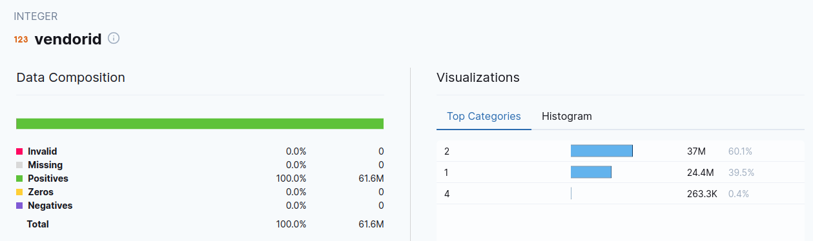
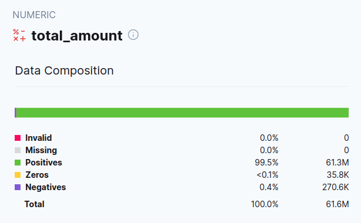
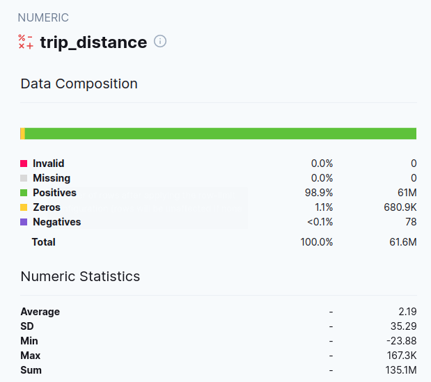

## Workshop: Maximizing Confidence in Your Data Model Changes with dbt and PipeRider

To learn how to use PipeRider together with dbt for detecting changes in model and data, sign up for a workshop

- Video: https://www.youtube.com/watch?v=O-tyUOQccSs
- Repository: https://github.com/InfuseAI/taxi_rides_ny_duckdb

## Homework

The following questions follow on from the original Week 4 homework, and so use the same data as required by those questions:

https://github.com/DataTalksClub/data-engineering-zoomcamp/blob/main/cohorts/2023/week_4_analytics_engineering/homework.md

Yellow taxi data - Years 2019 and 2020
Green taxi data - Years 2019 and 2020
fhv data - Year 2019.

## Preparation

Activate virtual environment 

`conda activate zoom`

(dbt is already installed in zoom venv: `pip install dbt-bigquery`)

Install piperider for Bigquery

`pip install 'piperider[bigquery]'`

Go to dbt folder used for week 4 homework. Run these commands:

`piperider init`

`piperider diagnose`

`piperider run`

Open the generated report, then open fact_trips report.

*Note 1*  

Due to way dbt precess the data, there is different amount of data every time you generate a fact_trips table. This might explain why my results are not exactly the same as the gicen answer options.

*Note 2* 

The questions asks to filter by 2019 and 2020. There are some (less than 0.01 %) rows that are before 2019 and after 2020. These are errors in the data and I have ignored them.

*Note 3* 

fhv data is not included

  
### Question 1:

What is the distribution between vendor id filtering by years 2019 and 2020 data?

You will need to run PipeRider and check the report

**Answer**

  
60.1/39.5/0.4

  

### Question 2:

What is the composition if total amount (positive/zero/negative) filtering by years 2019 and 2020 data?

You will need to run PipeRider and check the report

  
Closest match:

61.4M/25K/148.6K

  

### Question 3:

What is the numeric statistics (average/standard deviation/min/max/sum) of trip distances filtering by years 2019 and 2020 data?

You will need to run PipeRider and check the report

  
Closest match

2.95/35.43/-23.88/167.3K/181.5M

* 1.95/35.43/0/16.3K/151.5M
* 3.95/25.43/23.88/267.3K/281.5M
* 5.95/75.43/-63.88/67.3K/81.5M
* 2.95/35.43/-23.88/167.3K/181.5M
